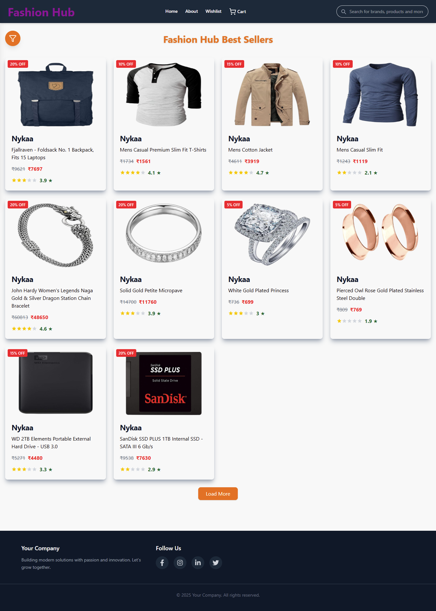

# 🛍️ Fashion Ecommerce App

A modern, responsive **E-commerce web application** built with **React (Vite)**, **Redux Toolkit**, and **TailwindCSS**, providing a fast and seamless shopping experience for users.

---
## 🚀 Live Demo  
🔗 [Fashion Ecommerce App](https://fashion-ecommerce-app-nine.vercel.app/)

## 📸 Screenshots

### 🏠 Home Page  


### 🛒 ProductDetails Page  


### 🛒 Wishlist Page  


### 🛒 About Page  


### 🛒 Cart Page  


### ✅ Payment Page  


## Features

**Product Browsing:**

* Search products by keywords
* Filter products by categories, price, or other attributes
* Pagination to browse large product catalogs

**Product Details:**

* View product images, descriptions, pricing, and availability

**Wishlist & Cart:**

* Add/remove items to wishlist
* Add/remove items to cart and adjust quantities

**Checkout:**

* Complete purchases with a smooth checkout workflow

**State Management:**

* Centralized store using **Redux Toolkit** for cart, wishlist, and product data

**UI/UX:**

* Responsive design built with **TailwindCSS**
* Modern, clean, and user-friendly interface

---

## Getting Started

### Clone the Repository

```bash
git clone https://github.com/<your-username>/fashion-ecommerce-app.git
```

### Install Dependencies

Navigate to the project folder:

```bash
cd fashion-ecommerce-app
npm install
```

### Run the Application

```bash
npm run dev
```


Open the application in your browser at: `http://localhost:5173`

---

## Technologies Used

**Front-End:** React.js, Redux Toolkit, TailwindCSS, Vite
**State Management:** Redux Toolkit
**Styling:** TailwindCSS

---

## Contributing

Contributions are welcome! Submit bug reports, feature requests, or pull requests via GitHub.

---

## License

This project is licensed under the MIT License.

---

## Contact

For any questions, reach out to me at `shaikmunni1314@gmail.com`


## **👩‍💻 Author**


# **Halimunnisa Shaik**
